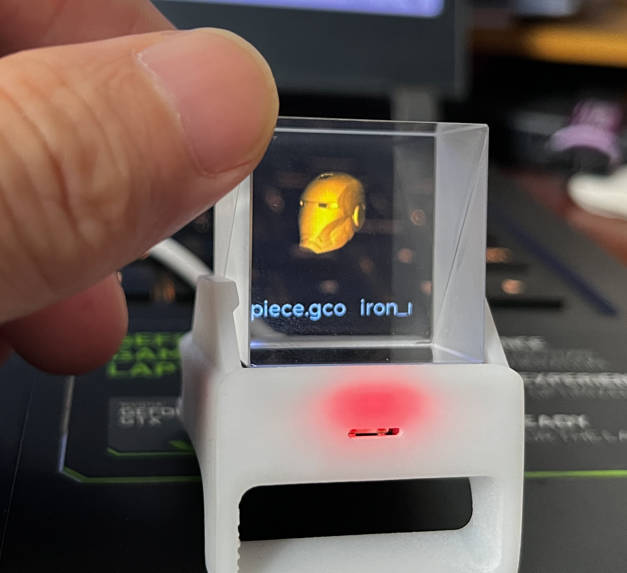
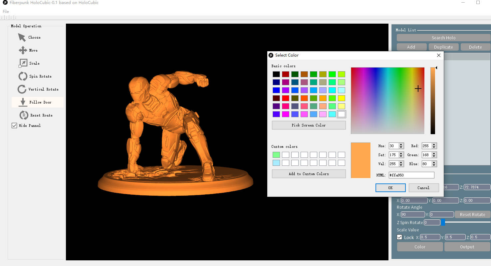

# Holo

[Youtube demo video](https://www.youtube.com/watch?v=17BWQ2w3EQg)

## 0. Project introduce

This project is a fork from [peng-zhihui's HoloCubic](https://github.com/peng-zhihui/HoloCubic), is used to implement STL and Gcode preview. When the light is turned off, it looks like the model is displayed in suspension. 

## 1. STL/Gcode gif generation

We have developed a windows software that can be used to generate 3D rotating animations of stl files. You only need to treat your stl file like software to generate animation.

[Download link](www.fiber-punk.com)

The main function:
- Search HoloCubic in local network
- STL model size, position editing
- Layout of multiple STL models
- STL model color editing
- Generate gif and send it to HoloCubic via wifi

This tool also provides the function of searching for holocubic devices in the local area network. After searching for the device, the generated animation can be transmitted to holocubic through wifi.

## 2. Community Support
This project comes from the open source community, please feel free to DIY it according to your needs. If you need help, you can follow the Fiberpunk community:

- Email: contact@fiber-punk.com
- [Website](https://fiber-punk.com/)
- [Facebook](https://www.facebook.com/Fiberpunk-103588222263591)
- [Discord](https://discord.gg/VNNFrfhsbN)

